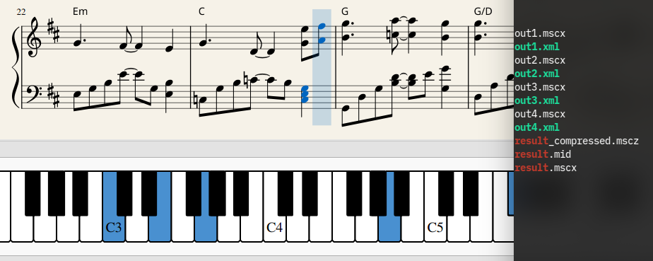

# pdf-omr-pmerge
Listen to PDF sheet music by converting it to a playable MIDI or a complete Musescore MSCX file. The script is intended to be a super quick and easy tool, see `Usage` [below](#usage). Thanks to dependencies [listed below](#more-stuff).
<p align="center">
  
  </br>
  <i>Playable output extracted from original <a href="https://github.com/kaisubr/pdf-omr-pmerge/raw/master/media/original.pdf">PDF file</a></i>
</p>

## Usage
Usage is very simple. You just need to provide a PDF file. 

```bash
./pmerge.sh "path/to/myfile.pdf"
```

The outputs will be a complete `result.mid` and `result.mscx` in the same directory (these can be opened with software such as MuseScore or Finale). MuseScore is provided in the binary release.

## Setting up
All dependencies (p2mp OMR, MIDISox for Perl) are provided in the repository, apart from `pdftk`. Optionally install `qpdf` if you are dealing with encrypted PDFs. Optionally provide MuseScore to generate MIDI files (I've found that this typically outputs a smaller size MIDI file).

```bash
git clone "https://github.com/kaisubr/pdf-omr-pmerge.git"
sudo apt-get install "pdftk"
chmod +x pdftomusicpro-1.7.1d.0.run
./pdftomusicpro-1.7.1d.0.run
which p2mp

# Install qpdf, optional
sudo apt-get install qpdf 

# MuseScore included in binary release
```

## Known issues and solutions
* Password-protected PDFs:
     - They can be decrypted using qpdf. Edit the script to provide a password with `qpdf -password=<password> -decrypt input.pdf decrypted.pdf`

## More stuff
Please use this script for private use only, not commercial or third-party use, and follow licenses provided by authors of dependencies.

Thanks to dependencies: mxcat (custom script), p2mp (PDFToMusic, pdftomusicpro-1.7.1d.0.run, included but must be executed, will add to /usr/bin automatically); pdftk (typically pre-installed)
 
Debug mode: Edit the first line of this file to: `#!/bin/bash -x`. You can also disable cleanup by removing the last few lines of this script.

<!-- cd musicxml && clear && echo -e "\n\n\n\n\n" && ls -1 && cd .. && ls | grep "mid" && echo -e "\n\n\n\n\n\n\n\n" -->
